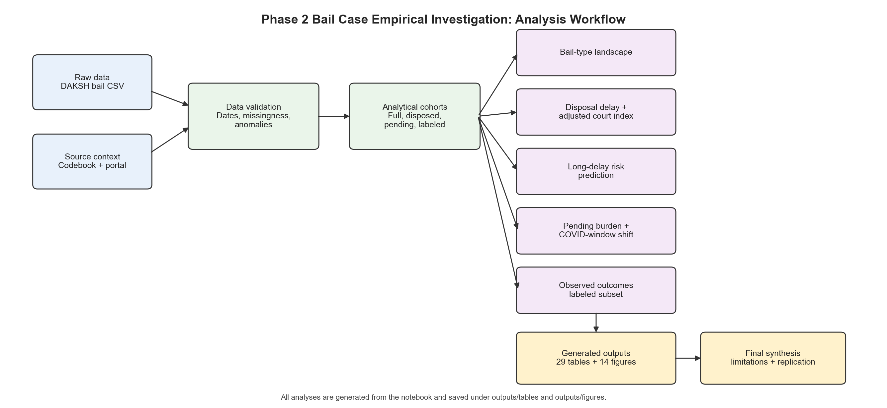

# Phase 2 Bail Case Empirical Investigation

## Abstract

This project uses the DAKSH High Court Bail Case dataset to study how bail type and High Court context relate to case processing in India. The analysis covers `927,896` bail case records across `15` High Courts and focuses on three connected outcomes: disposal delay, pending burden, and observed disposal outcomes where disposal labels are available.

The central research question is:

**How do bail type and High Court context shape delay, pendency, and observed outcomes in Indian High Court bail cases?**

The project is an empirical analysis of court-process data. It does not provide legal advice and does not estimate whether any individual person should receive bail. The predictive component is limited to historical long-delay risk because disposal time is directly measured for disposed cases and can be validated against held-out data.

## What To Open First

Open `Phase2_Bail_Empirical_Investigation.html` for the complete executed report. The notebook version, `Phase2_Bail_Empirical_Investigation.ipynb`, is included for reproducibility and rerunning the analysis.

## Research Design

Bail cases are not a single homogeneous category. Regular bail, anticipatory bail, and cancellation matters differ in legal purpose, registry conventions, distribution across courts, and observed processing time. The project therefore separates full-cohort analysis from restricted-cohort analysis and treats missingness as part of the empirical problem rather than an afterthought.

The notebook proceeds in five analytical stages:

1. **Data validation and cohort definition:** row counts, column counts, duplicate checks, mixed-date parsing, date anomalies, missingness, and court-level metadata coverage.
2. **Bail-type landscape:** distribution of regular bail, anticipatory bail, and cancellation cases across courts, filing years, and case-type labels.
3. **Disposal delay and court inequality:** median, p75, p90, p99, and adjusted court-delay comparisons among disposed cases.
4. **Long-delay risk prediction:** interpretable, dependency-free NumPy logistic model using filing-stage metadata and temporal train/test validation.
5. **Observed outcome analysis:** cleaned disposal-outcome groups for the labeled disposed subset, with outcome-label coverage reported before interpretation.

## Analysis Workflow

The project workflow is summarized in the generated diagram below:



The diagram shows the path from raw DAKSH data and codebook context to validation, analytical cohorts, empirical investigations, generated outputs, and final synthesis.

## Data And Analytical Cohorts

The analysis uses `Compiled Bail case data.csv`, selected from the DAKSH High Court Bail Case dataset. The local working folder contains the CSV. Because the file is large, the submission package may include `data_link.txt` instead of attaching the raw CSV directly. To reproduce all results, place `Compiled Bail case data.csv` in the project root or in a `data/` folder.

| Analysis area | Cohort used | Reason |
|---|---:|---|
| Bail-type mix | All `927,896` records | `Mapped_Bail`, court, year, and case type are available for the full dataset. |
| Disposal delay | Disposed records with valid disposal days and valid filing/decision dates | Disposal time is defined only after a case is disposed. |
| Pending burden | All records, interpreted as a scrape-date snapshot | `CURRENT_STATUS` and `PENDING_DAYS` describe case status at data sync/scrape time. |
| Long-delay model | Disposed cases split by filing year | Delay target requires disposal time; predictors exclude post-outcome leakage fields. |
| Observed outcomes | Disposed records with non-missing `NATURE_OF_DISPOSAL_OUTCOME` | Outcome labels are incomplete and not standardized across all courts. |

## Main Files

| File or folder | Purpose |
|---|---|
| `Phase2_Bail_Empirical_Investigation.ipynb` | Executed master notebook containing the complete empirical workflow. |
| `Phase2_Bail_Empirical_Investigation.html` | Static HTML version of the executed notebook. |
| `README.md` | Project summary, methodology, findings, limitations, and replication steps. |
| `CONTRIBUTION_STATEMENT.md` | Individual and shared contribution statement. |
| `data_link.txt` | Dataset source/citation context and link guidance for the large raw CSV. |
| `docs/Codebook_DAKSH_HighCourt_2023.pdf` | DAKSH field definitions and cleaning context. |
| `docs/02 Project.pdf` | Original project instructions. |
| `outputs/tables/` | Generated CSV tables used in the analysis and summary. |
| `outputs/figures/` | Generated PNG figures from the notebook. |
| `outputs/manifest.json` | Manifest of generated output files. |
| `scripts/build_phase2_notebook.py` | Script used to regenerate the notebook structure. |
| `requirements.txt` | Python package list for reproducing the analysis. |

## Empirical Investigations

### 1. Bail-Type Landscape

This module describes how regular bail, anticipatory bail, and cancellation cases are distributed across High Courts, filing years, and case-type labels. It establishes the composition of the dataset before comparing delay or pendency.

Key finding: regular bail is the dominant category, but anticipatory bail is also substantial and cancellation is rare.

| Bail type | Cases | Share |
|---|---:|---:|
| Regular bail | `639,099` | `68.88%` |
| Anticipatory bail | `283,392` | `30.54%` |
| Cancellation | `5,405` | `0.58%` |

### 2. Disposal Delay And Court Inequality

This module studies disposed cases using disposal days calculated from filing and decision dates. It compares bail types and courts using raw delay distributions and an adjusted court-delay index.

Key finding: cancellation matters take much longer than regular or anticipatory bail matters.

| Bail type | Disposed cases | Median days | p75 days | p90 days |
|---|---:|---:|---:|---:|
| Regular bail | `612,351` | `23.0` | `54.0` | `118.0` |
| Anticipatory bail | `261,041` | `37.0` | `86.0` | `175.0` |
| Cancellation | `3,558` | `267.5` | `809.75` | `1,556.1` |

The adjusted court-delay index compares each court's observed disposal time against expected disposal time for similar bail type, filing year, and case-type groups. It is a descriptive benchmark, not a causal estimate of court efficiency.

Highest adjusted delay indices:

| High Court | Adjusted delay index | Observed median days |
|---|---:|---:|
| High Court of Jammu and Kashmir | `397.55` | `156.0` |
| High Court of Manipur | `233.41` | `78.0` |
| High Court of Jharkhand | `192.31` | `51.0` |
| Orissa High Court | `123.33` | `42.0` |
| High Court of Chhattisgarh | `115.22` | `43.0` |

### 3. Long-Delay Risk Prediction

This module estimates whether a disposed case is likely to cross a long-delay threshold. The primary target is whether disposal days exceed the disposed-cohort p75 threshold. A p90 target is included as a robustness check.

The model uses filing-stage metadata only:

- High Court
- Bail type
- Case-type group
- Filing year
- Filing month
- Cleaned act group
- Cleaned section group

The model excludes leakage fields such as `CURRENT_STATUS`, `DECISION_DATE`, `DISPOSAL_DAYS`, `PENDING_DAYS`, `NATURE_OF_DISPOSAL`, and `NATURE_OF_DISPOSAL_OUTCOME`.

Key model results:

| Model | Test cases | Event rate | AUC | Brier score |
|---|---:|---:|---:|---:|
| p75 long-delay logistic | `80,000` | `0.240` | `0.637` | `0.194` |
| p75 court+bail baseline | `80,000` | `0.240` | `0.637` | `0.184` |
| p90 very-long-delay logistic | `80,000` | `0.091` | `0.623` | `0.093` |

The highest-risk quintile in the p75 model has about `1.41x` the overall long-delay rate. This supports the use of the model as historical risk context, not as a deterministic decision tool.

### 4. Pending Burden And COVID-Period Shift

This module studies pending cases as a snapshot of the dataset's sync/scrape date. Pending status is not a final lifecycle outcome, so interpretation is limited to unresolved burden at the time of data collection.

Highest pending rates by court:

| High Court | Total cases | Pending cases | Pending rate | Median pending days |
|---|---:|---:|---:|---:|
| Allahabad High Court | `25,733` | `12,600` | `48.96%` | `483.0` |
| High Court of Bombay | `58,850` | `11,093` | `18.85%` | `620.0` |
| High Court of Jammu and Kashmir | `2,022` | `230` | `11.37%` | `249.5` |
| Orissa High Court | `173,769` | `15,692` | `9.03%` | `300.0` |

The notebook also compares pre-2020 filing years with the 2020-2021 window, while treating the pandemic-period comparison as descriptive rather than causal.

### 5. Observed Bail Outcomes

This module analyzes `NATURE_OF_DISPOSAL_OUTCOME` only where outcome labels are available. Labels are cleaned into broad groups:

- `Allowed/Granted`
- `Rejected/Dismissed`
- `Withdrawn/Not Pressed`
- `Other/Disposed`

Outcome-label coverage is incomplete. Among disposed cases, the labeled outcome cohort covers about `32.45%`. Because coverage varies sharply by court, outcome results are interpreted as restricted-sample patterns rather than full-population bail outcome rates.

Observed outcome mix in the labeled subset:

| Bail type | Allowed/Granted | Other/Disposed | Rejected/Dismissed | Withdrawn/Not Pressed |
|---|---:|---:|---:|---:|
| Anticipatory bail | `39.38%` | `45.57%` | `10.06%` | `4.99%` |
| Cancellation | `4.66%` | `14.04%` | `77.99%` | `3.31%` |
| Regular bail | `56.32%` | `19.32%` | `18.51%` | `5.85%` |

## Quality Controls

- The notebook validates the expected raw column count: `32`.
- The notebook validates the parsed record count: `927,896`.
- Mixed date formats are parsed explicitly: `YYYY-MM-DD` and `DD-MM-YYYY`.
- All non-null core date values are parsed successfully.
- Duplicate identifiers and date anomalies are reported.
- Metadata completeness is reported by court before using legal metadata.
- Prediction features exclude post-filing and post-outcome leakage fields.
- The model is evaluated on a temporal split rather than a purely random split.
- Outcome analysis is separated from full-cohort delay and pendency analysis.
- Every output table and figure is generated by the executed notebook.

## Generated Outputs

The executed notebook creates `29` CSV tables and `14` figures. Important outputs include:

| Output | Description |
|---|---|
| `outputs/tables/00_validation_summary.csv` | Core validation checks. |
| `outputs/tables/00_date_parse_validation.csv` | Date parsing validation. |
| `outputs/tables/02_bail_type_counts.csv` | Bail-type distribution. |
| `outputs/tables/03_delay_by_bail_type.csv` | Disposal delay by bail type. |
| `outputs/tables/03_adjusted_court_delay_index.csv` | Adjusted court-delay index. |
| `outputs/tables/04_model_performance.csv` | Long-delay model metrics. |
| `outputs/tables/04_model_lift_summary.csv` | Risk concentration/lift summary. |
| `outputs/tables/05_pending_summary_by_court.csv` | Pending burden by court. |
| `outputs/tables/06_outcome_coverage_by_court.csv` | Outcome-label coverage by court. |
| `outputs/tables/08_results_synthesis.csv` | Final synthesis across investigations. |

## Interpretation Scope

The analysis is strongest for questions about process: filing patterns, disposal time, pending burden, court-level variation, and broad observed outcomes where labels exist. It is not designed to evaluate the merits of individual bail applications.

Individual bail-outcome prediction is not attempted because the dataset does not include the full factual record, custody duration, criminal history, evidence, arguments, or judicial reasoning. The long-delay prediction task is narrower and more appropriate because disposal time is directly measured for disposed cases.

Court comparisons should also be read carefully. The adjusted delay index accounts for bail type, filing year, and case-type group, but it remains a descriptive benchmark. It identifies where observed disposal time is higher or lower than comparable records in the dataset; it does not explain why those differences exist.

## Replication Steps

From the project folder:

1. Confirm Python has the required packages:

```bash
pip install -r requirements.txt
```

2. Place the dataset at one of these paths:

```text
Compiled Bail case data.csv
data/Compiled Bail case data.csv
```

3. Open and run:

```text
Phase2_Bail_Empirical_Investigation.ipynb
```

4. The notebook regenerates all tables and figures under:

```text
outputs/tables/
outputs/figures/
```

5. To regenerate the notebook structure before execution:

```bash
python3 scripts/build_phase2_notebook.py
```

## Data Source And Citation

Preferred citation from DAKSH:

DAKSH India (2023). DAKSH High Court Database: Bail Case dataset.

Official context:

- https://www.dakshindia.org/daksh-high-court-data-portal/
- https://database.dakshindia.org/bail-dashboard/

DAKSH notes that data availability gaps and other limitations may affect findings. This project therefore reports missingness, outcome-label coverage, date parsing validation, and cohort restrictions before interpreting results.
